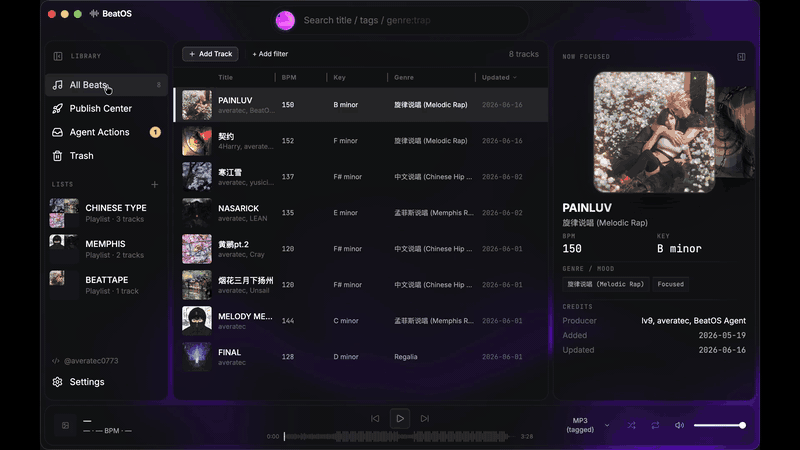

<div align="center">


# BeatOS

### The beat library built for how producers actually work.

Not a spreadsheet. Not a DAW. Not a marketplace. **BeatOS** is a local-first home for every beat on your drive — catalog it once with the metadata that *sells* beats, let AI do the tagging grind, and **export or publish to the platforms where you actually sell**. Runs as a native **desktop app (macOS · Windows)** or right in your **browser**. Single-user, offline, no account, no telemetry.

[](CHANGELOG.md)
[](#install--run)
[](LICENSE)
[](ROADMAP.md)
[](#two-ways-to-put-ai-to-work)

<br/>

**English** · [简体中文](README.zh-CN.md)

</div>

---

<div align="center">
  <br/>
  
  <br/><br/>
</div>

## Why BeatOS

I'm a beatmaker. Like most of us, my catalog lived in a spreadsheet, and every beat got its metadata typed out by hand into each platform I sell on. BeatOS is what I built instead — **one canonical catalog**, with three things nothing else puts together:

- 🎯 **Purpose-built for selling beats** — license tiers with multi-currency pricing, producer credits, tagged/untagged/loop/stems, BPM & key. Not a generic media manager bent into shape.
- 🤖 **AI-native** — talk to your catalog in plain language, draft genre/mood/tags from the cover, or wire it to Claude / Codex over MCP. Every edit waits for your approval.
- 🚀 **Built to ship, not just store** — export clean per-platform metadata and packaged loopkits / beat packs for free; **Pro adds assisted publishing** that drives a real browser and hands back at the platform's human-verification step.

> Hear the beats it was built around → [BeatStars](https://www.beatstars.com/averatec0773) · [网易云音乐 / NetEase](https://music.163.com/#/artist?id=50982361)

## What BeatOS can do

- **A catalog made to sell.** Every beat in a real SQLite database: title, BPM, key, genre + mood (multi-value), producer credits, tags, license tiers with multi-currency pricing, description, and per-role audio — tagged/untagged, loop, stems (WAV/MP3/FLAC) — plus cover art. Soft-delete trash with restore; rename or merge a producer across your whole catalog in one click. On a sale, generate a **per-buyer license PDF** (English or 中文) from any tier, and **export a tagged MP3** with the title, producer, BPM, key, and cover baked into the file's ID3 tags.

- **Find any beat instantly.** Search the whole catalog with stackable filters — BPM range, key, genre, mood, producer, has-audio — and recent searches one click away. The player queue follows whatever you're looking at.

- **Loopkits, beattapes & beat packs.** Curate beats into a list, then package it to send out — a loopkit, a beattape, a singer's beat pack. Pick per-track and per-file what goes in (bulk-select all WAVs, all MP3s), and export as a **ZIP** or a plain folder, one subfolder per track.

- **Analysis & AI tagging.** On-demand **BPM + key detection** with per-field confidence scores (Essentia, or the permissive librosa fallback) — one track or the whole library at once, auto-filling empty fields. Optional **AI tag suggestions** (bring your own key) draft genre/mood/tags from the cover + title for you to review field by field.

- **Chat with your catalog.** A built-in **AI Agent** in the sidebar — ask in plain language (*"find my untagged 2024 beats"*, *"tag these as chill"*, *"add a WAV tier"*) and the model actually reads and edits your catalog. Works with **Claude, ChatGPT, or DeepSeek** using your own key, stored on your device. Edits apply under your permission setting and are logged; destructive actions ask for a confirm first; read-only mode refuses writes. Conversations save locally and resume next launch.

- **Drive it from your own AI.** A first-class **MCP server** exposes the library to Claude Code, Claude Desktop, Codex, and any MCP client — **23 tools free, 28 with Pro** — so an agent in your terminal can organize, tag, and prep per-platform metadata for you.

- **Assisted publishing (Pro).** Publish a beat without leaving BeatOS: the engine drives a real browser and pauses at the platform's verification step, with a **Publish Center** showing live per-platform session health. Live targets today: **抖音 (Douyin) promo-video and NetEase 激灵 (BeatSoul)**, with **BeatStars** on the [roadmap](ROADMAP.md). Pro build only — the free build greys it out.

**And it feels like a product, not a database.** Spotify-style cards and Coverflow, a floating player, an animated WebGL backdrop (**Aurora** or **ASCII** glyph-rain), a glowing search orb, and a tunable glass panel-opacity layer — all bundled to run fully offline. Fully **bilingual (English / 中文)**, with an independent control for how genre/mood tags display.

## Desktop or browser — one codebase, two front ends

BeatOS ships as a **native desktop app** (Electron) and a **browser app** (a local web SPA served by the same Python sidecar). One React codebase builds both, so they stay in lockstep — Electron-only powers (native file dialogs, reveal-in-Finder, drag-out) route through a thin `platform` seam with a same-origin web implementation behind it.

- **Desktop** — the full native experience. `make dev` from source today; packaged installers land at `v0.1.0`.
- **Browser** — `make web` builds the SPA and serves it at `http://127.0.0.1:8765`: same backend, same library, near-identical UI, no Electron build. The easy way to run on Windows or anywhere today.

Both are **local-first and offline** — the browser app talks only to `127.0.0.1`. (Remote/LAN access and a mobile layout are planned.)

## Two ways to put AI to work

> **BeatOS is built for the AI-agent era.** Cataloging, tagging, and (soon) publishing are meant to scale without manual labor.

**In-app** — the **AI Agent** chat needs nothing but your own API key (Claude / ChatGPT / DeepSeek). Turn on AI Assist in Settings, paste a key, and start asking. Reads run directly; edits respect your permission mode and are logged.

**Your own AI client** — connect over **MCP**. Verified clients: Claude Code · Claude Desktop · Codex CLI/App · any client speaking stdio JSON-RPC.

**You stay in control either way.** Your MCP client gates each tool call (allow / deny per action), and every write the app makes is recorded in an **Agent Actions** dashboard — what changed, when, the result. Want a hard stop? Switch the agent to **read-only** and writes are refused. Batch tools (`create_tracks` ≤100, `attach_assets` ≤500) turn a 50-track import into one action instead of a hundred.

```text
You:    "Tag every beat above 140 BPM with no genre as 'Trap' or 'Drill',
         from the cover and title."

Claude: list_tracks(bpm_min=140) → 12 tracks → drafts a patch
        update_tracks(items=[...])    ← your client asks you to allow the call

You:    Allow

Claude: applied — the 12 edits land and show up in Agent Actions
```

<details>
<summary><b>All MCP tools (23 free · +5 Pro)</b></summary>

| Surface | Tools |
|---|---|
| **Read** | `list_tracks`, `get_track`, `search_tracks`, `list_lists`, `list_distinct_values`, `export_metadata`, `list_export_platforms`, `ping` |
| **Lifecycle** | `create_tracks`, `trash_tracks`, `restore_tracks`, `purge_tracks` |
| **Lists** | `create_list`, `update_list`, `delete_list`, `add_tracks_to_list`, `remove_tracks_from_list`, `reorder_list` |
| **Metadata** | `update_tracks`, `merge_metadata`, `set_license_tiers` |
| **Assets** | `attach_assets`, `detach_assets` |
| **Publishing (Pro)** | `publish_track`, `publish_status`, `list_publish_platforms`, `publish_session_status`, `list_publish_jobs` |

</details>

## Local-first, by design

- **No server.** The sidecar binds `127.0.0.1` and serves the browser front end same-origin. Nothing leaves the machine — including your conversations with the AI.
- **No account.** Single-user. No login, no sync, no cloud.
- **No telemetry.** Zero outbound calls from the app itself; your API key stays on your device.
- **Your files stay put.** BeatOS references paths; nothing is moved or renamed unless you ask.
- **Your data is yours.** One SQLite file in your per-user app-data folder (kept off cloud-synced directories where SQLite can corrupt; configurable in Settings). Open it with any tool.

## Install & run

> Packaged desktop installers arrive at `v0.1.0`. Until then, run from source. The browser front end needs no packaging.
> **Targets:** macOS 12+ · Windows 10+ · any modern browser. (Linux: dev + web only.)

**Prerequisites:** Node ≥22 LTS · Python 3.11.x · [`uv`](https://github.com/astral-sh/uv)

```bash
make sync && (cd apps/desktop && npm install)   # one-time setup

make dev    # desktop: Electron + sidecar
make web    # browser: build the SPA + serve it, open a tab
```

> **No terminal?** Double-click **`start-beatos.command`** (macOS) or **`start-beatos.bat`** (Windows) at the repo root — it checks/installs prerequisites, then launches the browser or desktop app.

<details>
<summary><b>Wire up the MCP server (Claude Desktop / Claude Code / Codex)</b></summary>

The MCP server lives at `packages/beatos-mcp`. It bridges your MCP client (stdio) to the app's sidecar over local HTTP. It attaches even when BeatOS is closed (showing a `beatos_status` tool), and the full library tools appear automatically once you open the app — no client restart needed.

1. **Install deps:** `uv sync` from the repo root (creates `.venv`). Re-run after pulling.
2. **Start BeatOS** and leave it open.
3. **One-click setup (recommended):** **Settings → AI Integration** → click your client. BeatOS merges the config (with a `.beatos.bak` backup) or runs `claude mcp add` for you.
4. **Manual fallback** — register it yourself (`--directory` must be the absolute repo path):

   ```json
   { "mcpServers": { "beatos": {
       "command": "uv",
       "args": ["run", "--directory", "/absolute/path/to/beatos", "beatos-mcp"]
   } } }
   ```

   Codex `config.toml`:
   ```toml
   [mcp_servers.beatos]
   command = "uv"
   args = ["run", "--directory", "/absolute/path/to/beatos", "beatos-mcp"]
   startup_timeout_sec = 20
   tool_timeout_sec = 120
   ```
5. **Verify:** restart the client, call `ping`. Writes are proposed, not applied — approve them in **Agent Actions**.

**Troubleshooting:** `sidecar not running` → the app isn't open (step 2) · `command not found` → run `uv sync` (step 1) · empty tools list → restart the client.

</details>

<details>
<summary><b>Pro build (publishing) & tests</b></summary>

**Pro build.** Publishing lives in the private `packages/pro/` submodule. With access:
```bash
git submodule update --init packages/pro
uv pip install -e packages/pro/beatos-publish --no-deps && uv pip install "patchright>=1.40"
make dev-pro    # or: make web-pro
```
Without it, the free build runs normally and greys out publishing. Full steps: [`packages/pro-mount-notes.md`](packages/pro-mount-notes.md).

**Tests.**
```bash
cd apps/desktop
npx vitest run                          # renderer + main
npm run build && npm run smoke          # desktop e2e (Playwright _electron)
npm run build:web && npm run smoke:web  # browser e2e (Playwright chromium)
uv run pytest packages/                 # Python sidecar (core + http + mcp)
```

</details>

## License

Apache License 2.0 — see [`LICENSE`](LICENSE) and [`NOTICE`](NOTICE).
Copyright 2026 Scott Huang ([averatec0773](https://github.com/averatec0773)).

---

<div align="center">

BeatOS is built and used daily by a working producer — [averatec.studio](https://averatec.studio).
Hear my music on [BeatStars](https://www.beatstars.com/averatec0773) and [网易云音乐 / NetEase](https://music.163.com/#/artist?id=50982361).

</div>
