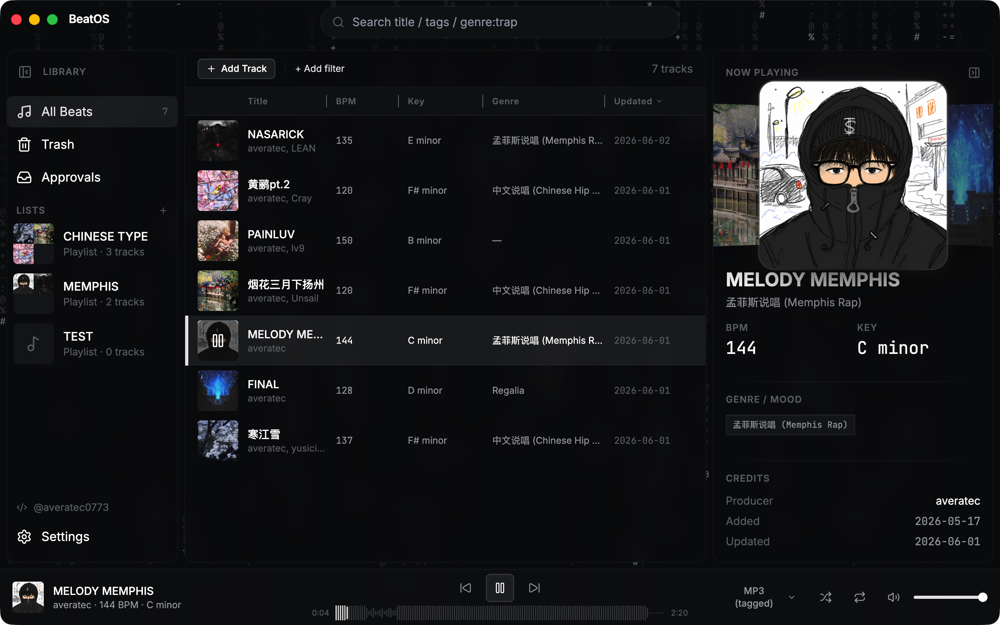
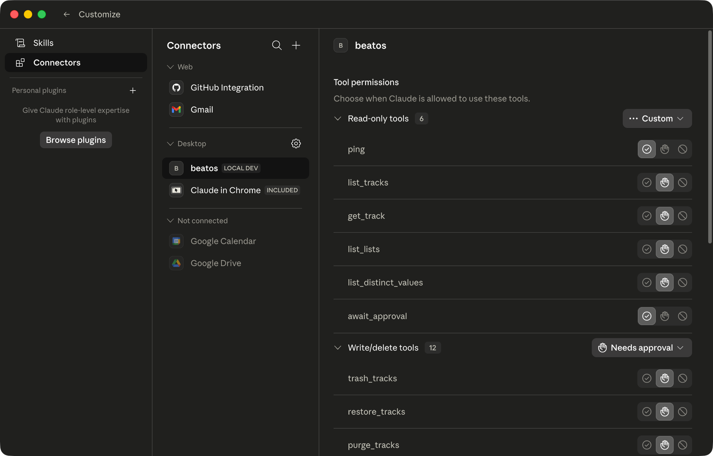

<div align="center">


# BeatOS

**The operating system for beat producers.**

A local-first library for every beat on your drive — catalog it once, run it as a **native desktop app or in your browser**, then ship it to every platform with an AI co-pilot doing the metadata grind for you.

[](CHANGELOG.md)
[](#run)
[](LICENSE)
[](ROADMAP.md)
[](#ai-integration)

</div>

---

<div align="center">
  <br/>
  
  <br/>
  <br/>
</div>

## The problem

A working beat producer ends up with hundreds of WAV/MP3 files on disk, two versions of each (tagged + untagged), cover art that isn't always next to the file, and a different metadata vocabulary for every platform:

- **NetEase / QQ Music / Suno / BeatStars / YouTube** — different genre trees, different mood tags, different description lengths, different price models.
- A track that's "Trap" on one site is "Hip Hop · 暗黑" on another, "Aggressive Lo-Fi" on a third, "未分类" on a fourth.
- **Every release means re-typing the same data in a different costume.** Multiply by 50 unfinished beats and 4 platforms — that's 200 metadata blocks to maintain by hand. Which is why most producers just don't publish.

BeatOS fixes this by keeping **one canonical catalog** locally, then letting **either you or an AI agent** translate it into the per-platform metadata block on demand.

## What it does today

<table>
<tr>
<td width="33%" valign="top">

### 1. Local catalog

A real SQLite database for every beat: title, BPM, key, genre (multi-value), mood (multi-value), producer credits, tags, license tiers + multi-currency pricing, description, audio assets (WAV/MP3 × tagged/untagged + loop + stems), cover art. Soft-delete trash with restore. Lists for curation. Rename + merge a producer across every track in one click.

</td>
<td width="33%" valign="top">

### 2. AI co-pilot (MCP)

A first-class **MCP (Model Context Protocol)** server exposes the library to Claude Code, Claude Desktop, and any MCP client — **24 tools** in the free build (**29** with Pro): read your catalog, draft per-platform descriptions, rename producers, propose batch attachments. Every write goes through a `token → await_approval` flow — the AI proposes, you confirm in the Agent Actions panel. A permission setting lets you tune that: confirm every action (default), auto-approve all, or read-only.

</td>
<td width="33%" valign="top">

### 3. Player + analysis

Spotify-style bottom bar (Tone.js + Web Audio) that plays the FLOAT-32 WAVs your DAW actually exports — in the desktop app **and** the browser. Audio roles per track with instant switch; queue follows the visible filter; shuffle + repeat. On-demand BPM/key analysis via a pluggable engine — Essentia when the optional extra is installed, else the permissive librosa fallback — with per-field confidence scores.

</td>
</tr>
</table>

## Desktop or browser — one codebase, two front ends

BeatOS ships as a **native desktop app** (Electron) and a **browser app** (a local web SPA served by the same Python sidecar). One React codebase builds both, so the two stay in lockstep: Electron-only capabilities (native file dialogs, Finder/Explorer integration, drag-out) route through a thin `platform` seam with a same-origin web implementation behind it.

| | |
|---|---|
| **Desktop** | The full native experience. `make dev` from source today; packaged installers at `v0.1.0`. |
| **Browser** | `make web` builds the SPA and serves it at `http://127.0.0.1:8765` from the local sidecar — **same backend, same library, near-identical UI**, with zero native-packaging cost. Handy for cross-platform use without an Electron build. File picking uses a built-in local file browser; "reveal in Finder/Explorer" and downloads work because the backend is your own machine. |

Both are **local-first and offline** — the browser app talks only to `127.0.0.1`. (Remote/LAN access and a mobile layout are on the [roadmap](ROADMAP.md).)

## AI integration

> **BeatOS is the first beat library built for the AI-agent era.** The MCP surface is not a side feature — it's how publishing is going to scale to 10 platforms without manual labor.

**Verified clients:** Claude Code CLI · Claude Desktop · any MCP client speaking stdio JSON-RPC.

<div align="center">
  <br/>
  
  <br/>
  <em>BeatOS registered as a Desktop MCP connector in Claude Desktop — read-only tools auto-allowed, writes gated behind approval.</em>
  <br/>
  <br/>
</div>

**Tools shipping today** (24 in the free build; the Pro build adds `publish_track`, `publish_status`, `list_publish_platforms`, `publish_session_status` + `list_publish_jobs` for **29**):

| Surface | Tools |
|---|---|
| **Read** | `list_tracks`, `get_track`, `search_tracks`, `list_lists`, `list_distinct_values`, `export_metadata`, `list_export_platforms`, `ping` |
| **Lifecycle** | `create_tracks`, `trash_tracks`, `restore_tracks`, `purge_tracks` |
| **Lists** | `create_list`, `update_list`, `delete_list`, `add_tracks_to_list`, `remove_tracks_from_list`, `reorder_list` |
| **Metadata** | `update_tracks`, `merge_metadata`, `set_license_tiers` |
| **Assets** | `attach_assets`, `detach_assets` |
| **Flow control** | `await_approval` |

**Why two-phase commit?** Every write tool returns a `token` (preview only) — nothing touches the database. The token surfaces in the **Agent Actions panel** in BeatOS; you review the diff, then confirm. The agent calls `await_approval` to learn the outcome. By default **an AI can never silently mutate your catalog**, batch-edit your producer credits, or trash a track without you signing off — unless you deliberately switch the permission setting to auto-approve (or lock it to read-only).

**Why batches?** A folder-import of 50 tracks × 2 audio assets would otherwise be 100 approval clicks. `create_tracks` (≤100), `attach_assets` (≤500), `detach_assets` (≤500) all batch — one token, one click, atomic rollback if any file vanishes mid-approve.

**Example flow** (driven by Claude Code from your terminal):

```text
You:    "Tag every beat above 140 BPM that has no genre with 'Trap' or 'Drill'
         based on the cover art and title. Show me the diff before applying."

Claude: [calls list_tracks(bpm_min=140) → 12 tracks]
        [reads metadata, drafts a patch]
        [calls update_tracks(items=[...]) → returns token abc123]

You:    [opens BeatOS Approvals panel, sees 12 proposed edits with rationale]
        [reviews 3, rejects 1, approves the batch]

Claude: [await_approval → status=approved, applies, reports back]
```

The same pattern drives on-demand per-platform metadata export today, and will drive publish drafts (Pro) and self-corpus RAG drafts (v0.3+).

## Local-first, by design

| | |
|---|---|
| **No server.** | The sidecar binds `127.0.0.1` on a local port — and serves the browser front end from there too, same-origin. Nothing leaves the machine, including conversations with the MCP agent. |
| **No account.** | Single-user. No login, no sync, no cloud. |
| **No telemetry.** | Zero outbound calls from the app itself. |
| **Your files stay put.** | BeatOS references paths; nothing is moved or renamed unless you ask. |
| **Your data is yours.** | One SQLite file on your disk (`~/Music/BeatOS/global.db` by default). Open it with any tool. |

## Install

> Packaged desktop installers will arrive at `v0.1.0` together with the first publish adapter. Until then, run from source — see [Develop](#develop). The browser front end needs no packaging: `make web` and open a tab.

**Targets:** macOS 12+ · Windows 10+ (desktop) · any modern browser (web). Linux works for development and the web front end, but isn't a supported desktop install target.

## Develop

**Prerequisites**

- Node ≥22 LTS
- Python 3.11.x
- [`uv`](https://github.com/astral-sh/uv) — `brew install uv` (macOS) or `pipx install uv`

**Setup**

```bash
make sync                              # resolve Python workspace
cd apps/desktop && npm install
```

> **Pro build (publishing).** Publishing is a Pro feature in the private `packages/pro/`
> submodule. With access to it: `git submodule update --init packages/pro`, then
> `uv pip install -e packages/pro/beatos-publish --no-deps` + `uv pip install "patchright>=1.40"`, then
> run with **`make dev-pro`** (desktop) or **`make web-pro`** (browser) — each reinstalls the engine after `uv sync`, which the free `make dev` / `make web` prune.
> Full steps in [`packages/pro-mount-notes.md`](packages/pro-mount-notes.md). Without it,
> the free build runs normally and greys out the publish entry.

### Run

```bash
make dev                               # desktop: Electron + sidecar (or: npm run dev:fresh)
make web                               # browser: build the SPA + serve it from the sidecar, open a tab
npm run logs:tail                      # follow main.log + sidecar.jsonl  (from apps/desktop)
```

> **No terminal?** Double-click **`start-beatos.bat`** (Windows) or **`start-beatos.command`** (macOS)
> at the repo root — it checks/installs the prerequisites, then launches the browser or desktop app.

### Wire up the MCP server (Claude Desktop / Claude Code)

The MCP server lives at `packages/beatos-mcp`. It does **not** talk to SQLite directly — it bridges your MCP client (stdio) to the **running app's** sidecar over local HTTP. First-time setup, in order:

1. **Install the Python deps** — from the repo root: `uv sync`. This creates `.venv` with every workspace package *and* the `mcp-proxy` stdio bridge the launcher execs. Re-run after pulling.

2. **Start BeatOS first.** The bridge attaches to the sidecar of the *running* app: it reads a handshake file and exits with `BeatOS sidecar not running` if the app is down. Launch the desktop app (or `start-beatos.command` / `start-beatos.bat`) and leave it open.

3. **Register the server** in your MCP client config — `--directory` must be the **absolute** repo path:

   ```json
   {
     "mcpServers": {
       "beatos": {
         "command": "uv",
         "args": ["run", "--directory", "/absolute/path/to/beatos", "beatos-mcp"]
       }
     }
   }
   ```

4. **Verify** — restart the client, then call `ping` (or `list_tracks`). Writes are proposed, not applied: each write tool returns a token you approve in the app's **Agent Actions** panel (`token` → `await_approval`). Attaching audio uses `attach_assets` with `role: "audio"` and an absolute `.wav`/`.mp3` path on this machine.

> **Troubleshooting first connect:**
> - `BeatOS sidecar not running (no handshake…)` → the app isn't open. Do step 2.
> - `command not found: mcp-proxy` or `beatos-mcp` → deps aren't installed. Do step 1 (`uv sync`).
> - Tools list is empty after connecting → restart the MCP client so it re-reads the config.

### Test

```bash
cd apps/desktop
npx vitest run                         # renderer + main (Vitest)
npm run build && npm run smoke         # desktop end-to-end (Playwright _electron)
npm run build:web && npm run smoke:web # browser end-to-end (Playwright chromium)

uv run pytest packages/                # Python sidecar (core + http + mcp)
```

## Stack

`Electron 39` · `React 19` · `Vite` · `Tailwind` · `Radix UI` · `Zustand` · `TanStack Virtual` · `dnd-kit` · `Tone.js`
`Python 3.11` · `FastAPI` · `aiosqlite` · `structlog` · `mcp` (FastMCP) · `librosa` / `essentia` (optional) · `Playwright`
`SQLite` · `Pydantic v2`

The single React renderer builds to two targets — Electron (`electron-vite`) and a browser SPA (`vite.config.web.ts`) the FastAPI sidecar serves at `/`.

## Repository

```
apps/desktop/              Electron shell + React renderer (also builds the browser SPA)
packages/
  beatos-core/             Pure Python business logic (no web/RPC deps)
  beatos-http/             FastAPI facade — serves the renderer API, /api/fs, and the web SPA
  beatos-mcp/              stdio MCP server for AI agents
  beatos-platforms/        Per-platform vocab maps
  pro/                     Private submodule — Pro features (platform publishing); absent in the free build
screenshots/               README assets
```

## Roadmap

Currently in the **dogfood phase** — UI/UX patches land as `0.0.X.Y` releases. The catalog, the AI/MCP surface, on-demand metadata export, and the **desktop + browser** front ends are shipped; platform publishing is a Pro module. Next up: the first packaged installer + publish adapter (NetEase Cloudmusic), and — for the web front end — remote/LAN access and a mobile layout.

Full plan: [`ROADMAP.md`](ROADMAP.md) · Shipped history: [`CHANGELOG.md`](CHANGELOG.md).

## License

Apache License 2.0 — see [`LICENSE`](LICENSE) and [`NOTICE`](NOTICE).

Copyright 2026 Scott Huang ([averatec0773](https://github.com/averatec0773)).

---

<div align="center">

Made by [averatec0773](https://github.com/averatec0773) · [averatec.studio](https://averatec.studio)

</div>
